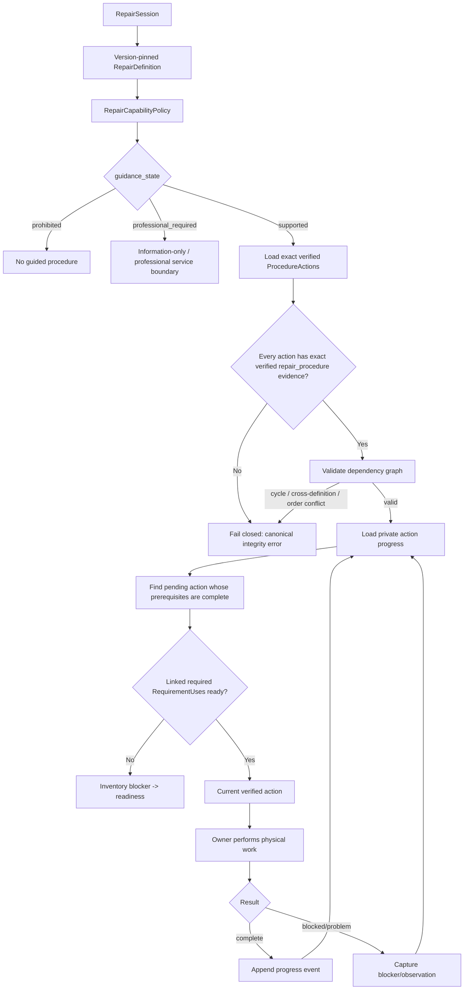
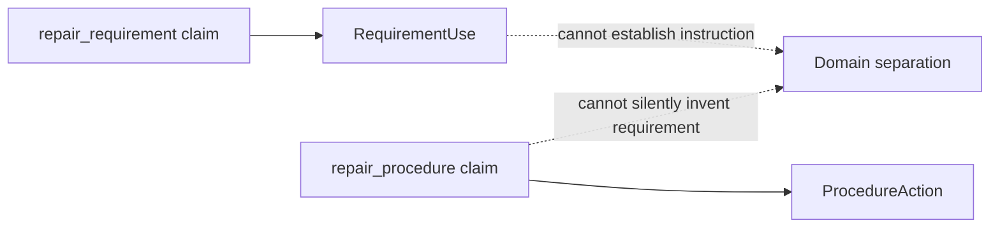
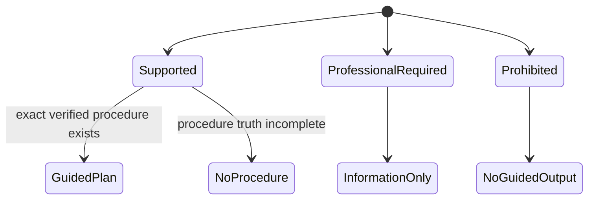

# Block 11 verified procedure model

This document supplements the living `PARTGRAPH_SYSTEM_UML.md` while Block 11 is active. It describes the procedure/safety structure being implemented; GitHub issue #48 remains the execution source of truth.

## Canonical-to-private mapping

```mermaid
classDiagram
    class VehicleConfiguration
    class RepairDefinition {
      +UUID id
      +UUID vehicle_configuration_id
      +UUID capability_policy_id
      +repair_key
      +version
      +status
    }
    class RepairCapabilityPolicy {
      +policy_key
      +guidance_state
      +rationale
    }
    class ProcedureAction {
      +action_key
      +title
      +instruction
      +warning_text?
      +workspace_note?
      +position
    }
    class ProcedureActionDependency
    class ProcedureActionRequirementUse
    class ProcedureActionEvidence
    class RequirementUse
    class MechanicalClaim {
      +claim_domain = repair_procedure
      +exact_applicability
      +promotion_state
    }
    class RepairSession
    class ProcedureActionState

    VehicleConfiguration "1" --> "many" RepairDefinition
    RepairCapabilityPolicy "1" <-- "many" RepairDefinition
    RepairDefinition "1" --> "many" ProcedureAction
    ProcedureAction "many" --> "many" ProcedureAction : prerequisite
    ProcedureAction "1" --> "many" ProcedureActionRequirementUse
    RequirementUse "1" <-- "many" ProcedureActionRequirementUse
    ProcedureAction "1" --> "many" ProcedureActionEvidence
    MechanicalClaim "1" <-- "many" ProcedureActionEvidence
    RepairDefinition "1" <-- "many" RepairSession : version-pinned binding
    RepairSession "1" --> "many" ProcedureActionState : Block 11D
```

`ProcedureActionState` is shown as the next private-state boundary; it is intentionally not part of migration `0012` yet.

## Safety gate and next-action loop

## Provenance separation

A requirement claim establishes what a repair needs. A procedure claim establishes an explicit action. PartGraph does not use a tool/part requirement as evidence for a mechanical instruction.

## Capability states

The capability decision is deterministic database/domain truth and is evaluated before action text is returned. An LLM cannot override this policy.
