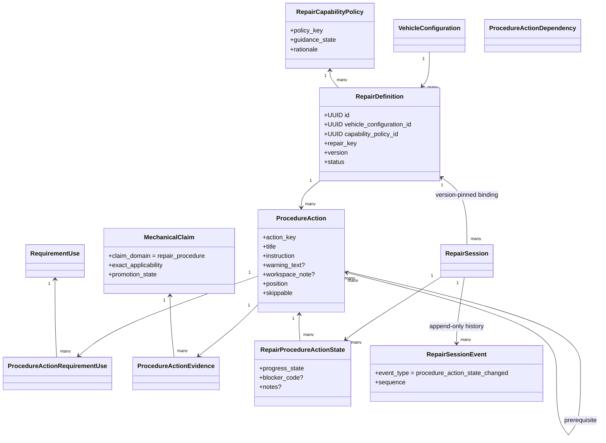
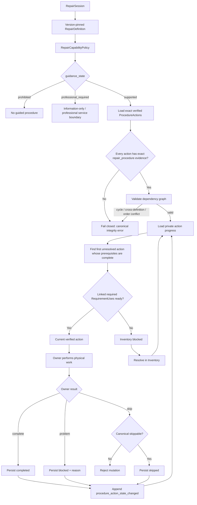
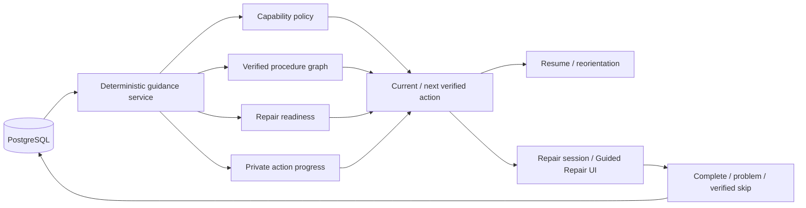
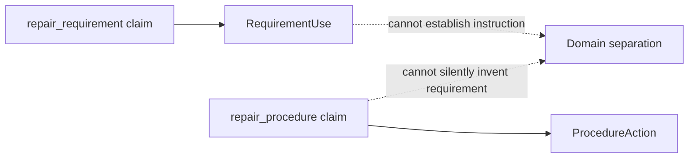
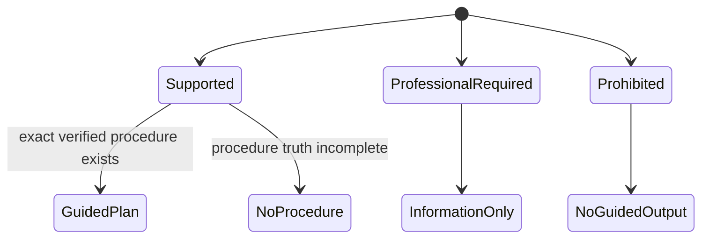

# Block 11 verified procedure model

This document supplements the living `PARTGRAPH_SYSTEM_UML.md` while Block 11 is active. It describes the implemented procedure/safety/progress structure; GitHub issue #48 remains the execution source of truth.

## Canonical-to-private mapping

Canonical procedure truth is shared and immutable through verification/versioning. `RepairProcedureActionState` and `RepairSessionEvent` are private owner-scoped state; PostgreSQL row-level security (RLS) isolates them from other users.

## Safety gate and next-action loop

The engine does not silently advance past a blocked action. Completion is rejected while an explicitly linked required Inventory item is unresolved. Skip is not a generic user escape hatch; it is valid only when canonical procedure truth explicitly marks that action `skippable`.

## Resume and Guided Repair share one calculation

There is no frontend event-history waterfall and no LLM/network/collector dependency in this critical path. A user may change devices and still reconstruct the same server-authoritative repair position.

## Provenance separation

A requirement claim establishes what a repair needs. A procedure claim establishes an explicit action. PartGraph does not use a tool/part requirement as evidence for a mechanical instruction.

## Capability states

The capability decision is deterministic database/domain truth and is evaluated before action text is returned. An LLM cannot override this policy.
