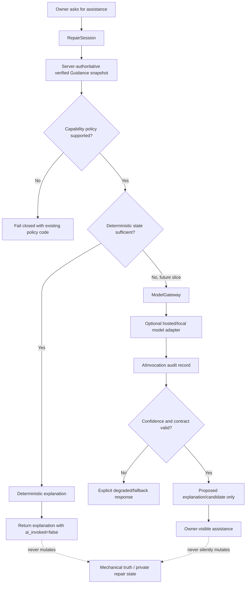
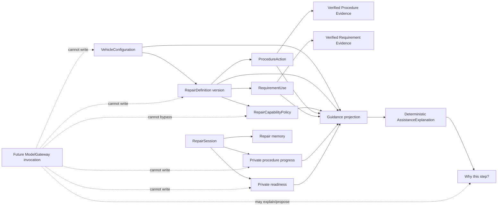
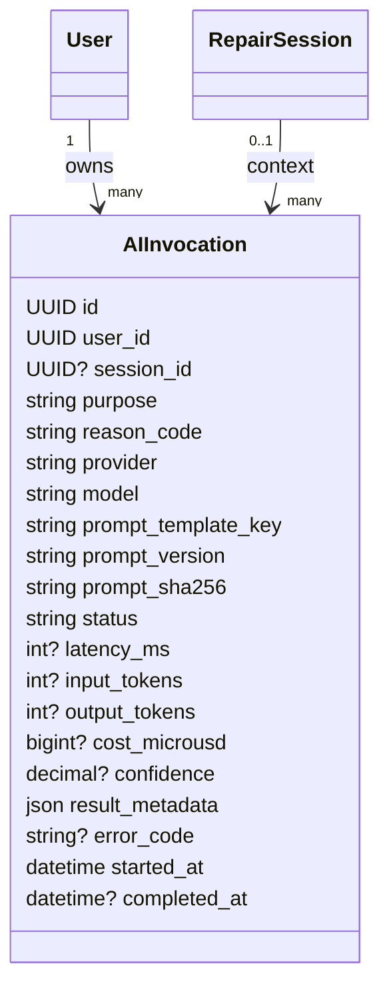
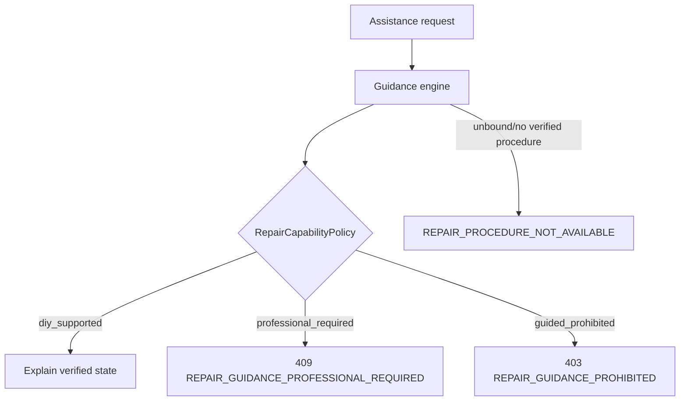

# PartGraph Block 12 — Assistance and Learning Model

Block 12 adds assistance only after PartGraph has exact vehicle identity, verified repair requirements, readiness, verified procedure guidance, and resumable physical state.

The governing rule is:

> AI may explain, rank, extract, classify, or propose. It may not become mechanical truth or silently mutate repair state.

## 1. End-to-end assistance decision



Block 12A implements the deterministic path, the provider-neutral gateway contract, and the audit persistence boundary. It does **not** wire a model provider, add embeddings, collect repair content, or perform model training.

## 2. Truth and assistance separation



## 3. Code ownership boundary

The five-PR restructuring tracked by issue #62 makes assistance and intelligence different responsibilities.

```text
partgraph.assistance
    owner-facing deterministic feature
    verified guidance -> explanation

partgraph.intelligence
    ModelGateway protocol
    ModelRequest / ModelResult
    candidate-only result kinds
    AIInvocation audit state
    DisabledModelGateway current default
```

`assistance` is independently useful without a model provider. `intelligence` cannot own canonical mechanical data or RepairSession mutations.

During the restructuring sequence, `partgraph.assistance.models.AIInvocation` remains a compatibility import of `partgraph.intelligence.models.AIInvocation`. The physical PostgreSQL table and migration history do not move or reset; only code ownership changes.

The provider-neutral result kinds currently permitted by the intelligence contract are:

- `explanation`
- `proposal`
- `classification`
- `ranking`
- `extraction`

There is intentionally no `canonical_truth` or state-mutation result kind.

## 4. AI invocation audit boundary

Every future production AI invocation must be attributable without storing raw private prompt text as the audit primitive.



`ai_invocations` is private owner state protected by PostgreSQL row-level security (RLS). The application role receives select/insert/update only; no cross-owner visibility is allowed.

## 5. Deterministic explanation contract

`GET /api/v1/repair-sessions/{session_id}/assistance/explanation`

The endpoint consumes the exact same guidance snapshot already used by Guided Repair. It returns no new repair instruction. It explains one of four states:

| reason_code | Meaning |
| --- | --- |
| `next_verified_action` | current action is deterministic and ready |
| `current_action_inventory_blocked` | current action is next but required Inventory is not Have |
| `current_action_physically_blocked` | owner recorded a problem; PartGraph will not silently advance |
| `verified_procedure_complete` | all canonical actions are completed or explicitly skippable-and-skipped |

The response always reports `mode=deterministic` and `ai_invoked=false` in Block 12A.

## 6. Safety inheritance

The assistance endpoint delegates current-state reconstruction to the existing verified guidance engine. Therefore the same capability gate executes **before** assistance can access procedure action text:



There is no separate AI safety override. An optional future model adapter sits downstream of this deterministic gate.

## 7. Provider-neutral gateway contract

The current gateway is deliberately disabled:

```text
Assistance / future intelligence request
        |
        v
ModelGateway protocol
        |
        +--> DisabledModelGateway  [current default]
        |
        +--> hosted provider adapter  [future]
        |
        +--> local model adapter      [future]
```

`DisabledModelGateway.invoke()` fails closed with `MODEL_GATEWAY_DISABLED`. Core PartGraph behavior does not catch that failure and silently invent an answer; deterministic repair state remains usable without the model path.

A future provider adapter receives a bounded `ModelRequest` and returns a `ModelResult`. Provider-specific SDK objects do not leak into repair-domain services. This allows hosted or local providers to change later without rewriting the authoritative repair workflow.

## 8. Failure behavior

- deterministic assistance has no network/model dependency;
- model/provider outage cannot affect page load, readiness, Resume, or next-action computation;
- future AI failure must return an explicit degraded state while preserving the deterministic workflow;
- AI results may become proposals, never automatic readiness/progress/fitment/safety mutations;
- full VINs, session tokens, passwords, and other secrets must never be written to AI audit metadata or prompts.

## 9. Local acceptance contract

`local-validation/assistance_acceptance.py` proves through the running API and disposable PostgreSQL state that:

1. an exact synthetic repair binds normally;
2. deterministic assistance explains the same first action as Guided Repair;
3. after progress advances, assistance mirrors the real Inventory blocker;
4. after readiness is resolved, assistance mirrors the downstream available action;
5. another owner receives `REPAIR_SESSION_NOT_FOUND`;
6. deterministic assistance creates zero `AIInvocation` rows;
7. `guided_prohibited` remains a 403 boundary through the assistance endpoint.

The randomized acceptance harness remains local-only and outside GitHub Actions/deployment.

## 10. Deferred agent boundary

The external PartGraph Research Agent and synthetic PartGraph QA Agent discussed for future work are **not implemented in this block**.

This restructuring only establishes a stable intelligence seam so those systems do not need direct database access or provider-specific coupling later. When implemented under their future roadmap blocks:

- a Research Agent must behave as a restricted external contributor and submit provenance-backed candidates to staging, never canonical truth;
- a QA Agent must behave as a synthetic owner through supported application boundaries and its synthetic sessions must never contaminate real observational/training/canonical data.

Those future actors do not change the current Block 12A runtime behavior.