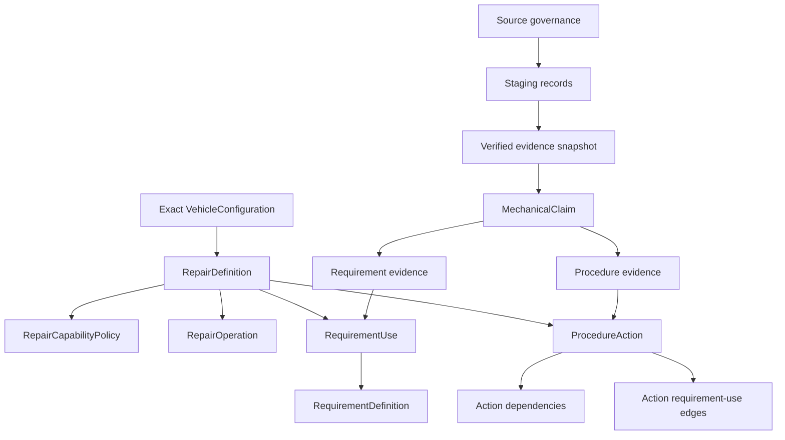
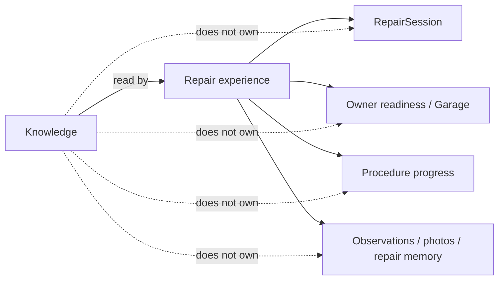

# PartGraph canonical knowledge boundary

Restructure PR 2/5 gives canonical automotive knowledge one explicit Python ownership boundary: `partgraph.knowledge`.

The move is architectural only. It does not introduce new source collection, model inference, repair coverage, tables, or API behavior.

## 1. What Knowledge owns



Knowledge owns:

- catalog-staging batches and source records;
- immutable promoted evidence snapshots;
- source governance and promotion policy;
- normalized mechanical claims and explicit conflict/promotion state;
- exact-applicability repair definitions and versions;
- requirement definitions, uses, operations, and evidence edges;
- guided procedure actions, dependencies, requirement-use edges, and evidence edges;
- repair capability policy;
- deterministic manifest aggregation;
- verified manifest/procedure read services and schemas.

## 2. What Knowledge does not own



`UserGarageInventoryItem` and `RepairRequirementState` are private owner state. They remain temporarily in the legacy `repair_definition.models` module only so PR 2 does not consume PR 3's repair-experience scope.

## 3. Compatibility migration

```text
canonical implementation
        ↓
partgraph.knowledge.*
        ↓
legacy compatibility imports
        ↓
partgraph.catalog.*
partgraph.repair_definition.*
        ↓
existing callers continue to work
```

The compatibility modules re-export the exact same Python class/function objects. They do not declare duplicate SQLAlchemy tables.

This lets PR 3 and PR 4 move downstream consumers independently. PR 5 can remove obsolete compatibility paths after parity is proven.

## 4. Database invariant

No database migration is required for PR 2.

Python ownership changes while these remain identical:

- table/schema names;
- primary/foreign keys;
- unique/check constraints;
- existing rows;
- repair-definition IDs and versions;
- evidence IDs and claim IDs;
- external API paths and response contracts.

Therefore a persisted database created before PR 2 remains valid without a data copy or table rename.

## 5. Truth boundary

The existing rule remains unchanged:

> Source collection, parsers, retailers, community evidence, and AI may produce candidates. Canonical mechanical truth requires the existing promotion/evidence/applicability boundary.

A future Research Agent therefore enters through staging/contributor interfaces, not by writing `RepairDefinition`, `RequirementUse`, `ProcedureAction`, or `MechanicalClaim.promotion_state='verified'` directly.

That future agent is explicitly outside PR 2.
