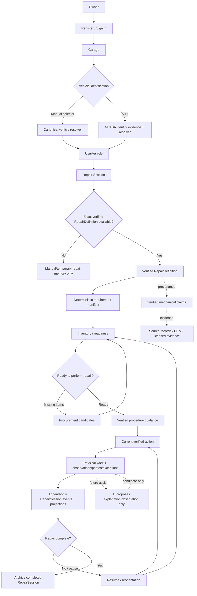
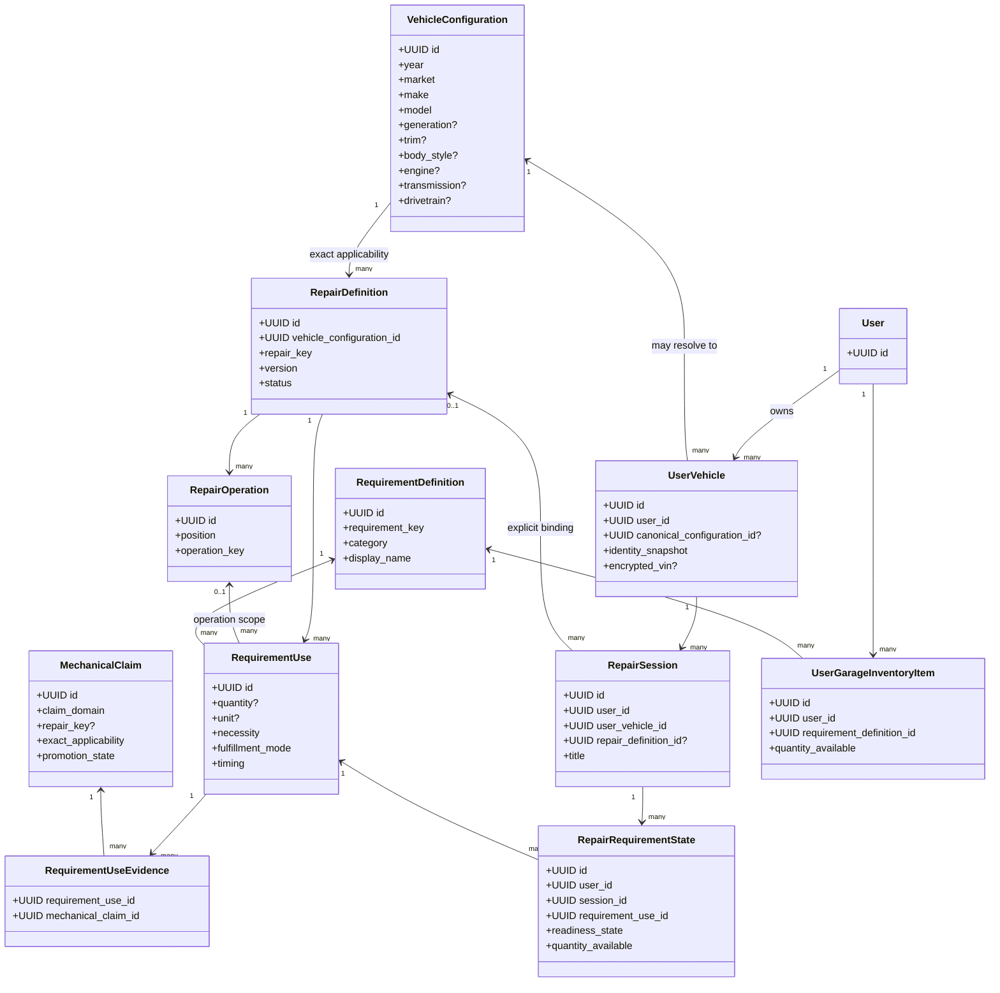
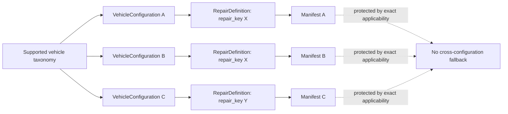
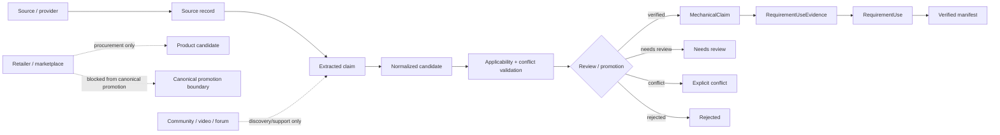
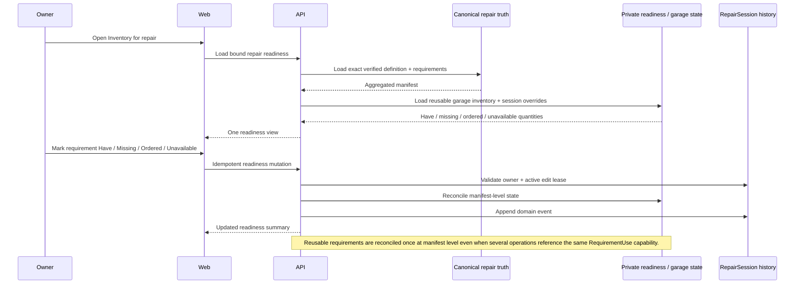
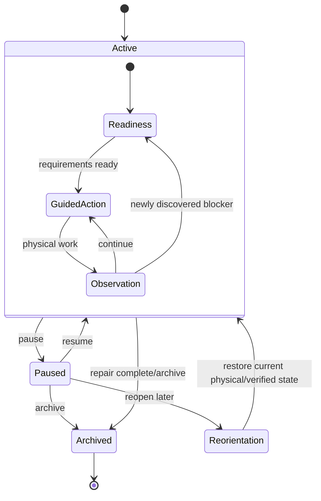
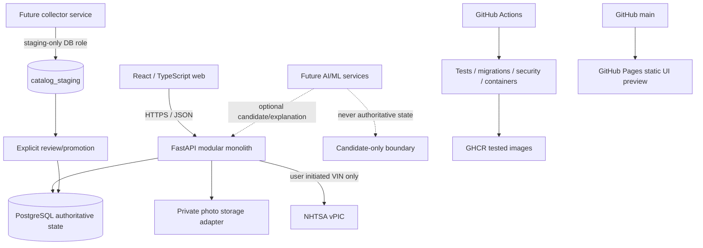
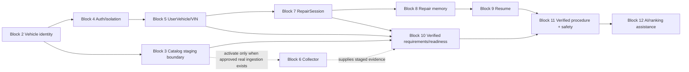
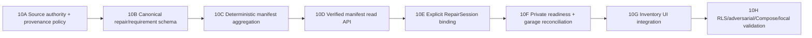

# PartGraph system UML

This document is the living visual map of the PartGraph product and architecture. It is not a sprint board or a second source of execution truth. GitHub issues and pull requests define implementation status; this document explains how the pieces connect from vehicle identification through repair readiness, guided repair, resume, procurement, and future AI assistance.

## Product invariant: broad vehicle coverage

PartGraph is not a Honda-specific application. Honda and the 2009 Civic Hybrid are a real-world validation case. Canonical repair truth is always scoped by `VehicleConfiguration`, so the same architecture supports every manufacturer, model, trim, engine, transmission, drivetrain, body style, market, and model year represented by the supported vehicle taxonomy when verified repair data exists for that exact configuration.

Current market boundary is US and Canada, model years 1996 through the current calendar year, subject to the controlled manufacturer policy in the vehicle-identity domain.

A repair definition for one vehicle configuration must never leak into another configuration merely because names look similar.

## 1. End-to-end product flow

## 2. Canonical truth versus private owner state

The key boundary is deliberate:

- `VehicleConfiguration`, `RepairDefinition`, `RequirementDefinition`, `RequirementUse`, and verified claims are shared canonical truth.
- `UserVehicle`, `RepairSession`, garage inventory, readiness state, observations, photos, and physical repair memory are private owner state protected by authorization and PostgreSQL row-level security where applicable.

## 3. Manufacturer/model/trim applicability mapping

A shared `repair_key` identifies the type of repair; it does **not** make requirements interchangeable across vehicles. The canonical lookup key is effectively:

`exact VehicleConfiguration + repair_key + verified/current definition version`

This is what prevents a Honda requirement, Toyota requirement, or even a different Civic trim/engine requirement from being reused merely because the repair name is the same.

## 4. Evidence-to-canonical-truth pipeline

No collector, parser, retailer, community source, or AI model writes canonical mechanical truth directly.

## 5. Repair-readiness reconciliation loop

## 6. Pause/resume loop

## 7. Service/component architecture

The future collector is intentionally separate from the interactive repair path. GitHub Pages is only a static frontend preview; a full public application still requires runtime hosting for FastAPI and PostgreSQL.

## 8. Block dependency map

Collector implementation is deliberately deferred until there is an approved real source to ingest. It is not a reason to block deterministic canonical/readiness architecture.

## 9. Block 10 sub-block map

Sub-blocks are explanatory implementation structure, not Scrum stories. A sub-block can remain inside the same issue/PR unless isolation materially improves review, testing, or rollback safety.

## 10. Non-negotiable truth rules

1. Vehicle applicability is exact and explicit; similarity is not fitment.
2. Honda is a validation case, not an architectural special case.
3. Repair requirements belong to repair definitions/operations, not globally to a part.
4. Canonical mechanical truth is separate from private user state.
5. Retailer links are procurement candidates after fitment/specification truth exists.
6. AI may propose, rank, explain, or summarize; it does not silently create mechanical truth.
7. Unknown stays unknown; conflicts stay explicit.
8. Core readiness/resume/next-action paths do not depend on collectors or AI being online.
9. Ordinary users should reconcile a requirement once, not maintain duplicate operation-level bookkeeping.
10. Safety/capability policy may restrict guided procedures even when informational repair data exists.
